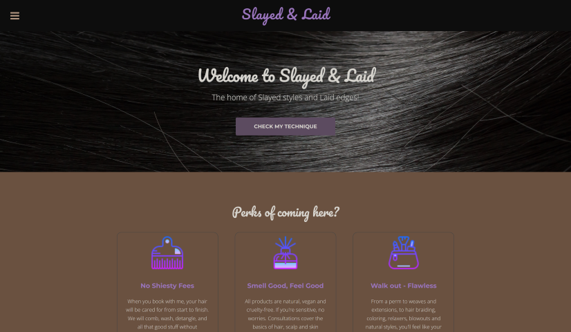
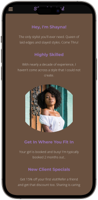

# Slayed & Laid Salon

A personal business site created to showcase the artistry and expertise of a hair stylist. Includes testimonials and contact information. 

## Table of contents

- [Overview](#overview)
  - [Screenshot](#screenshot)
  - [Links](#links)
- [My process](#my-process)
  - [Built with](#built-with)
  - [What I learned](#what-i-learned)
  - [Useful resources](#useful-resources)
- [Author](#author)

## Overview

### Screenshot

### Links

- Repository URL: [Here](https://github.com/codewithjazzy/SlayedAndLaidSalon)
- Live Site URL: [Here](https://slayedandlaid.netlify.app/)

## My process

### Built with

  
   

### What I learned

Fleshed out some of my HTML and CSS skills.

- Font & Styling edits

### Useful resources

- [MDN Web Docs](https://developer.mozilla.org/en-US/) - Always a tab away for brushing up on methods or troubleshooting broken code

## Author
- LinkedIn - [@CodeWithJazzy](www.linkedin.com/in/codewithjazzy)
- Twitter - [@CodeWithJazzy](https://twitter.com/CodeWithJazzy)